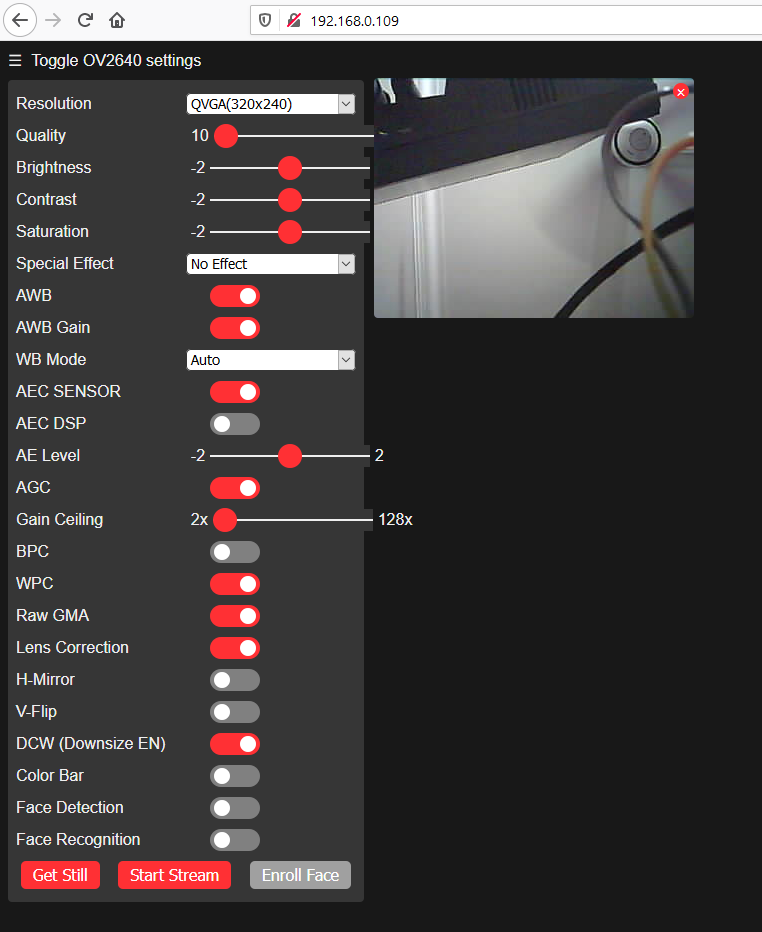

## CameraWebServer_ESP32-CAM.ino

* Configure WiFi SSID

    ```
    const char* ssid = "Your SSID";
    const char* password = "Your Password";
    ```

* Setup Camera CSI pin assignment

    ```
      camera_config_t config;
      config.ledc_channel = LEDC_CHANNEL_0;
      config.ledc_timer = LEDC_TIMER_0;
      config.pin_d0 = Y2_GPIO_NUM;
      config.pin_d1 = Y3_GPIO_NUM;
      config.pin_d2 = Y4_GPIO_NUM;
      config.pin_d3 = Y5_GPIO_NUM;
      config.pin_d4 = Y6_GPIO_NUM;
      config.pin_d5 = Y7_GPIO_NUM;
      config.pin_d6 = Y8_GPIO_NUM;
      config.pin_d7 = Y9_GPIO_NUM;
      config.pin_xclk = XCLK_GPIO_NUM;
      config.pin_pclk = PCLK_GPIO_NUM;
      config.pin_vsync = VSYNC_GPIO_NUM;
      config.pin_href = HREF_GPIO_NUM;
      config.pin_sscb_sda = SIOD_GPIO_NUM;
      config.pin_sscb_scl = SIOC_GPIO_NUM;
      config.pin_pwdn = PWDN_GPIO_NUM;
      config.pin_reset = RESET_GPIO_NUM;
      config.xclk_freq_hz = 20000000;
      config.pixel_format = PIXFORMAT_JPEG;
    ```

* Connect WiFi network

    ```
      WiFi.begin(ssid, password);
    
      while (WiFi.status() != WL_CONNECTED) {
        delay(500);
        Serial.print(".");
      }
    ```

* Start httpd Web Camera Server
    
    ```
      startCameraServer();
    
    ```

## app_httpd.cpp
* Setup Web Server endpoint

    ```
        if (httpd_start(&camera_httpd, &config) == ESP_OK) {
            httpd_register_uri_handler(camera_httpd, &index_uri);
            httpd_register_uri_handler(camera_httpd, &cmd_uri);
            httpd_register_uri_handler(camera_httpd, &status_uri);
            httpd_register_uri_handler(camera_httpd, &capture_uri);
        }
    ```

* index landing page callback 
    
  ```
    static esp_err_t index_handler(httpd_req_t *req){
        httpd_resp_set_type(req, "text/html");
        httpd_resp_set_hdr(req, "Content-Encoding", "gzip");
        sensor_t * s = esp_camera_sensor_get();
        if (s->id.PID == OV3660_PID) {
            return httpd_resp_send(req, (const char *)index_ov3660_html_gz, index_ov3660_html_gz_len);
        }
        return httpd_resp_send(req, (const char *)index_ov2640_html_gz, index_ov2640_html_gz_len);
    }
    ```

* streaming of camera source
  + `fb = esp_camera_fb_get();` : Grab camera image frame buffer
  + `frame2jpg(fb, 80, &_jpg_buf, &_jpg_buf_len)` : convert a frame buffer to jpg format
  + `res = httpd_resp_send_chunk(req, (const char *)_jpg_buf, _jpg_buf_len);` : publish frame image
    ```
    static esp_err_t stream_handler(httpd_req_t *req){
        camera_fb_t * fb = NULL;
        esp_err_t res = ESP_OK;
        size_t _jpg_buf_len = 0;
    
    ```
  
* capture image of camera source
  + `fb = esp_camera_fb_get();` : Grab camera image frame buffer
  + `res = httpd_resp_send(req, (const char *)fb->buf, fb->len);` : publish 
    ```
    static esp_err_t capture_handler(httpd_req_t *req){
        camera_fb_t * fb = NULL;
        esp_err_t res = ESP_OK;
        int64_t fr_start = esp_timer_get_time();
    
        fb = esp_camera_fb_get();
        if (!fb) {
            Serial.println("Camera capture failed");
            httpd_resp_send_500(req);
            return ESP_FAIL;
        }
    ...
    }
    
    ``` 
    
* Browser Page using ESP WebServer Library
 